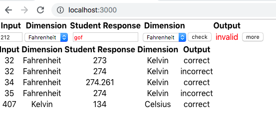
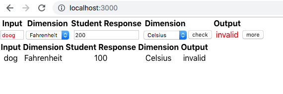

This project was bootstrapped with [Create React App](https://github.com/facebook/create-react-app).

## Introduction

This project repo allows a teacher to input the answers from a Heat and Temperature conversion worksheet.  The display has an element on the top that allows the teacher to add entries and each entry is displayed below.

The students are asked to convert input temperatures between:
Fahrenheit, Celsius, Kelvin and Rankine

In this case, the app is composed of 2 components and a container.  The 2 components are: TemperatureDimension and ProblemItem. The container is called Worksheet.  The TemperatureDimension component is used to enter temperature conversion information provided by the student.  ProblemItem, which uses the TemperatureDimension component, is a stand-alone component that checks the student work, edits their results and provides feedback. Input fields are:

+ An input temperature, of the form: several digits, a decimal point and 1, 2 or more digits.  
+ The student must choose a dimension for the input
+ The student then enters their converted temperature
+ The student also enters the dimension of their converted temperature

For example: the problem specifies: 212 Fahrenheit, the student responds with 100 Celsius and the app responds with "correct."  Or, the problem specifies: 212.2 Fahrenheit and the student responds with 123.4 Celsius.  In this case the app replies with 'incorrect'

If the problem specifies an input temperature of 'dog' the app will respond with 'invalid' and highlight that input in red.  If the student response is 'dog' the app will highlight this in red, and mark the response as 'invalid'

### Assumptions

There is very little styling in the output.  It is assumed that a designer will provide feed-back and then the output can be adjusted.

There is no database to save the answers to.  This was not stated in the requirements.  This is an easy add on

### CI/CD

I did not create a CI/CD configuration.  I will describe what I envision.  The described setup can be extended to handle code coverage (cobrature).  I will only consider: 
+ unit testing on the local machine
+ developer feature branch check pull requests to development-stage 
+ development-stage deploy to development

#### Unit testing 

Unit testing of a visual app can take place with Jest, StoryBook or other frameworks.  In this case, the app handles editing of the inputs.  The allows many combinations of inputs.  It marks invalid inputs in red and provides a 'correct', 'incorrect' or 'invalid' response to inputs.

combinations that where tested for include:

+ invalid student input with several other inputs showing

+ invalid problem statement specification

In addition, Jest unit tests are supplied. 

#### feature branch checkin

The developer should use feature branches, never work directly on any "main" branch. The git flow paradigm uses team review of individual work.  These reviews generate general knowledge of the system, and astute team members can coach / mentor less experienced members in ways to improve their work.  While fully automatic promotion is possible, I feel it is in the team's interest to manually review contributions before deployment. In many cases, the additions in a feature branch are going to generate conflict.  These conflicts need to be resolved before git can merge the feature.

The developer would use 'git' to checkout a new feature branch with a name that makes is easy to understand what is in that branch.  When the developer feels the feature is working they use 'git' again to create a pull request.  The team will review the pull request and approve or not.  

Part of reviewing the pull request is having Jenkins automatically investigate your feature for you.  This happens in 2 places: on the local machine and on the github site.  On the local machine use Jenkins to (these are all components of a Jenkinsfile):
+ A) create an environment, for example a docker image, 
+ B) build the code in that environment, in this case, have Jenkins issue a  'npm install', 
+ C) run any tests on the code, for example using selenium to input data to the page and check for proper colors and output information
+ D) create and collect all reports,

These reports can be gathered together and provided as evidence in the review.

On the github site, it is a good idea to have Jenkins automatically run the above steps again with one difference.  If all of the tests pass, Jenkins can add a stage in the Jenkinsfile to deploy from development-stage to development.

## trying this repo

Since the app was created with create-react-app, you can clone the repo and use npm to try it out.

+ git clone https://github.com/muguira-james/testsre.git
+ npm install
+ npm start
